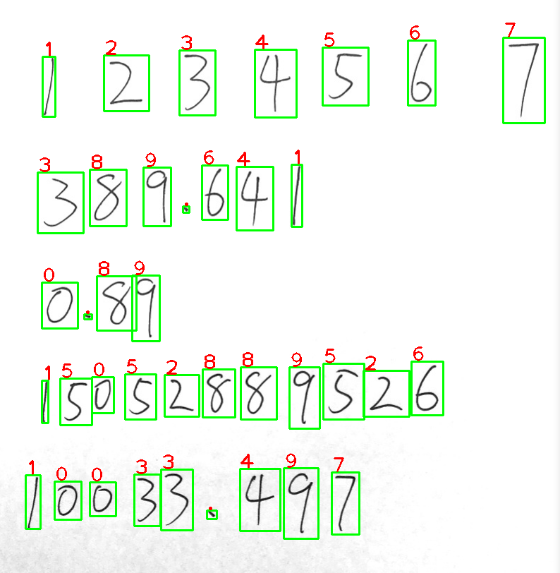
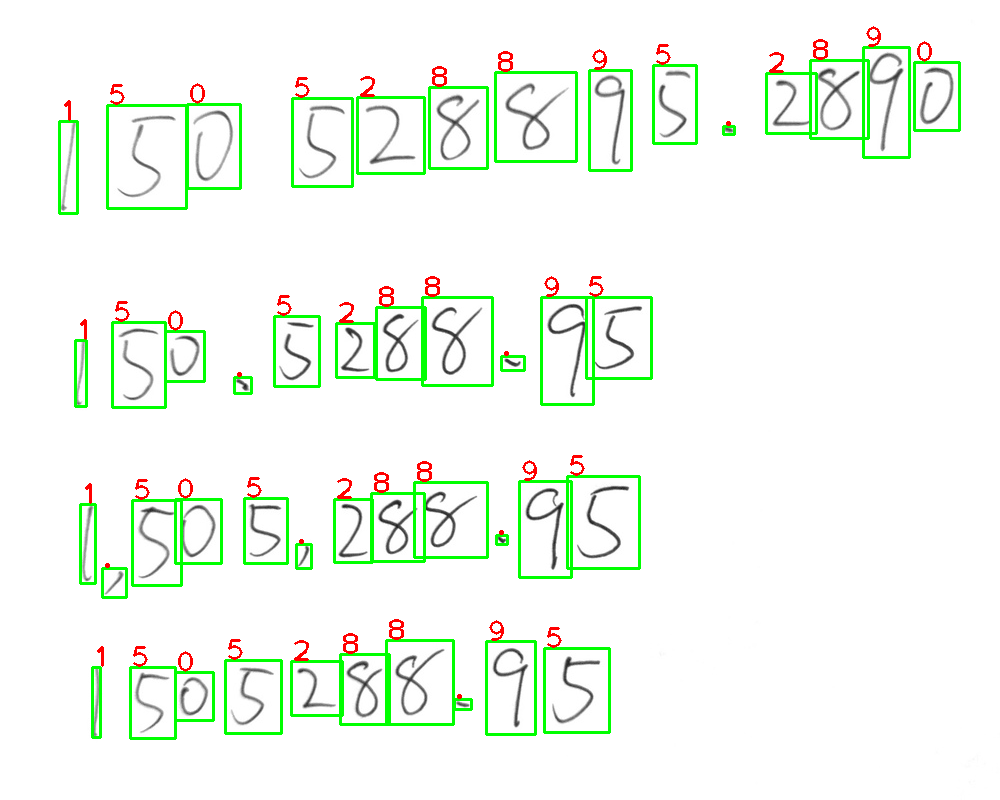

# image2digits
Automatic detection and recognition for handwritten digits and numbers

# Requirements: 
  python3, numpy, caffe, opencv, scipy, tesseract, pytesseract
# Usage:
  > python3 image2digits [image name]
